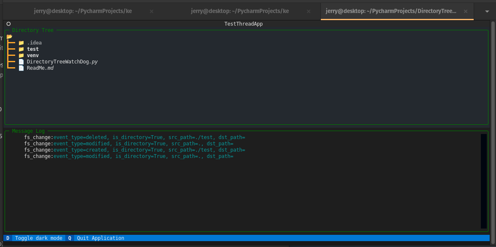

# WatchDog Notifications within Textual

## Reason for Existing
- I did not find any examples of using watchdog within Textual.
- I did find any long-running thread examples with Textual.
- I needed both for a project I'm building (Knowledge Engineer)
- I wanted to give a little bit back to the community.

## References:
- [Watchdog Documentation](https://pythonhosted.org/watchdog/) 
- [Textual DirectoryTree](https://textual.textualize.io/widgets/directory_tree/)

## on_mount()
There is some homework required to set up the Watchdog.  I choose to do this in the on_mount of the app.  It could have been moved into the FSEHandler.__init__(...) to hide more of the logic.  I guess the code would have been cleaner that way, but the code would not have been easier to understand.  And this example is about helping people understand how to handle long-running threads in Textual. 

# epilogue
For Anything else see the code, or ask me in the Textual Discord...

Jerry The Dinosaur 